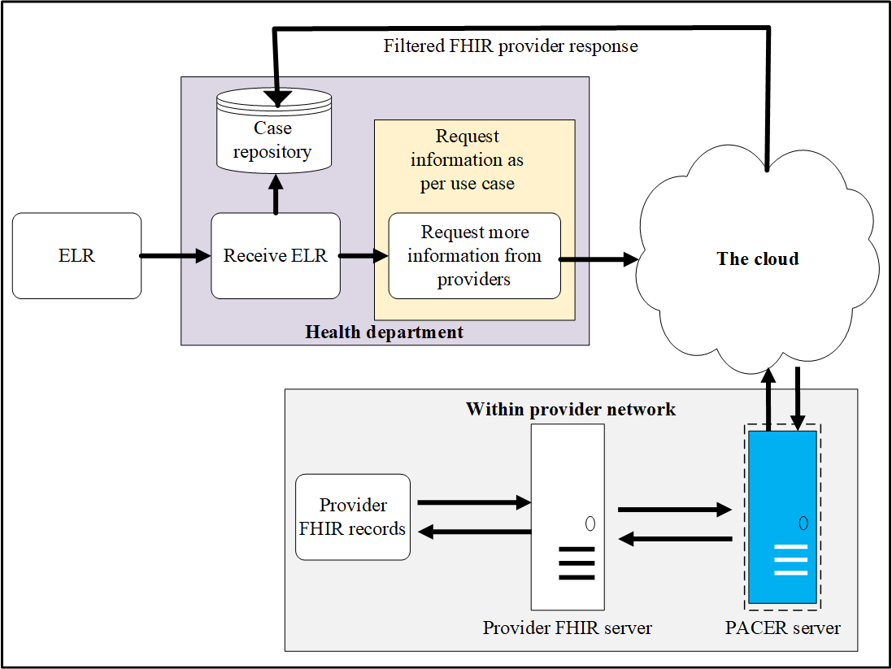
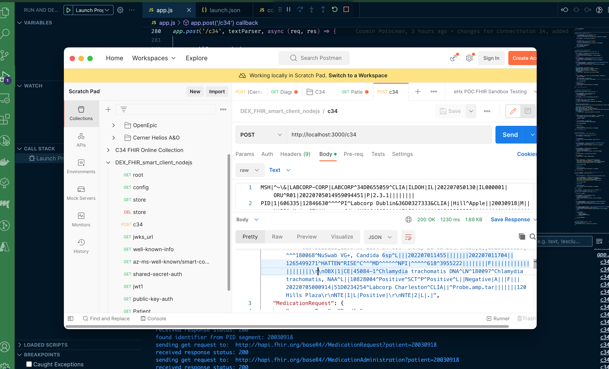
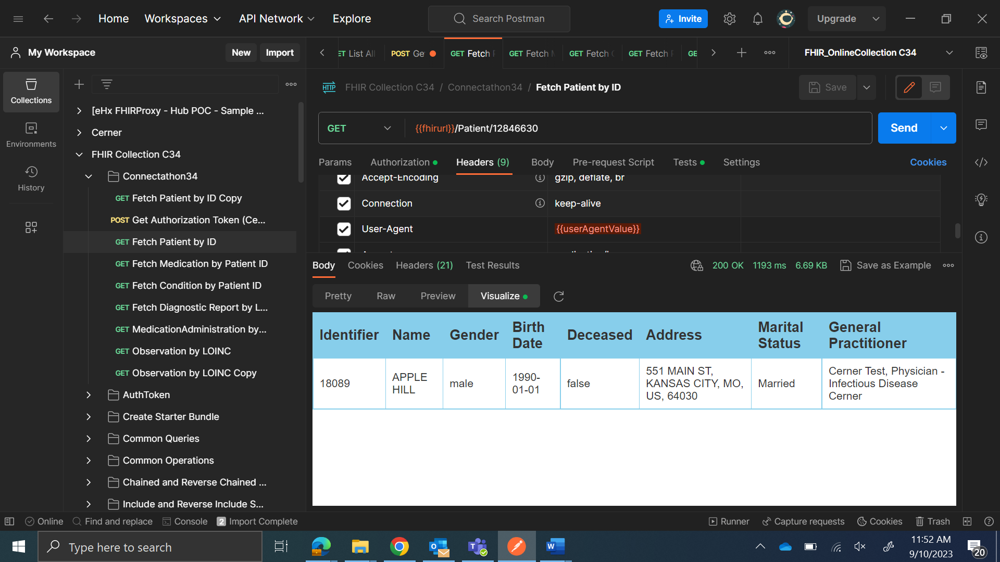
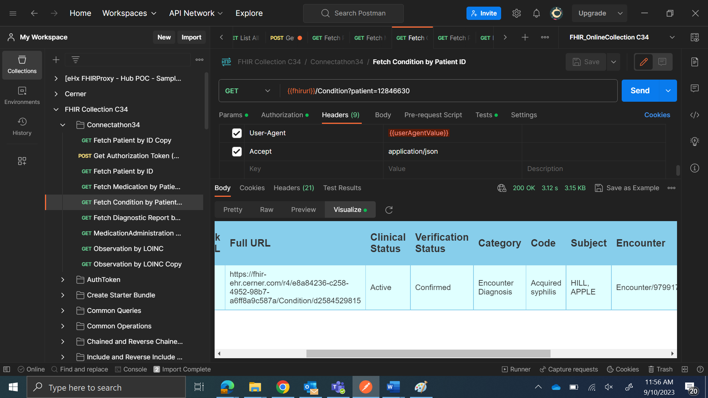
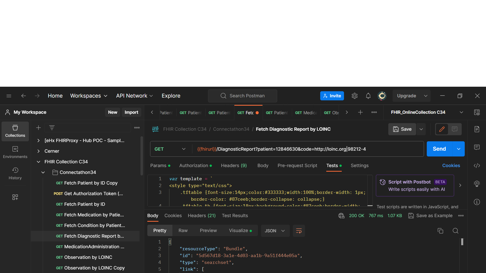
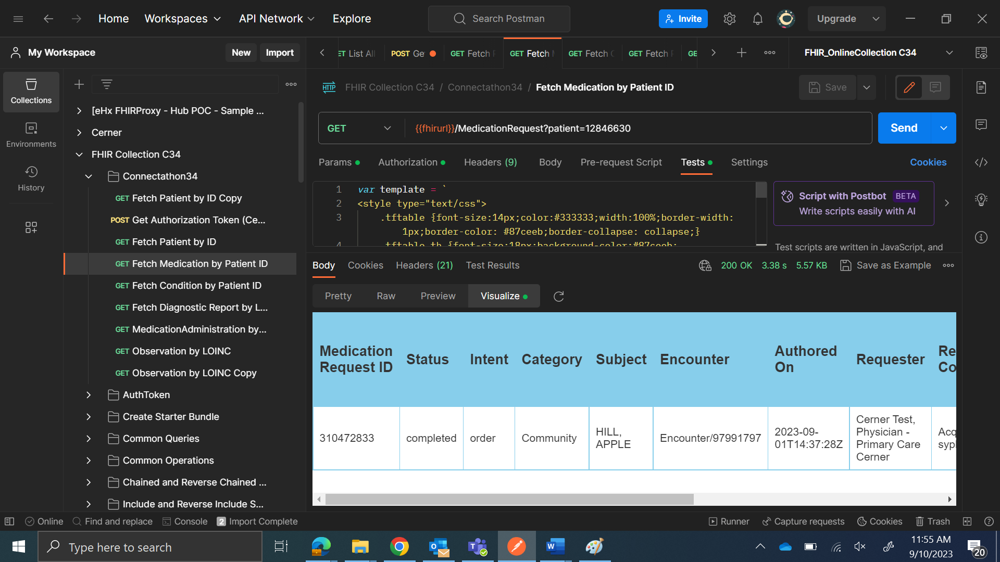
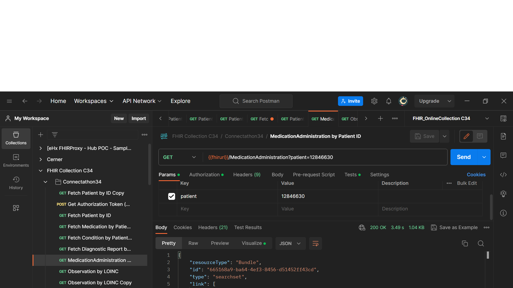
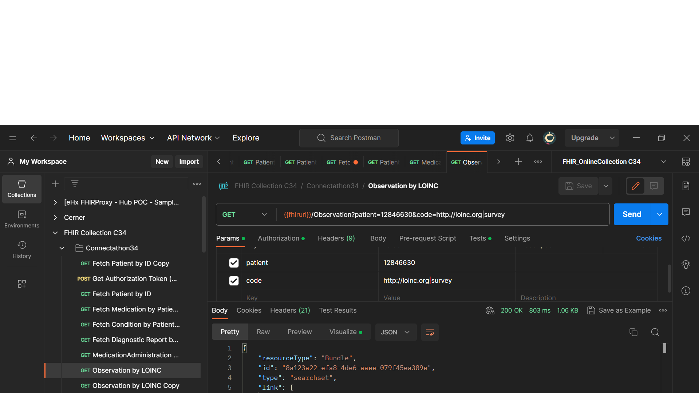

# HL7 FHIR Connecthaton 34, [HELIOS Align and Optimize (A&O)](https://confluence.hl7.org/pages/viewpage.action?pageId=175606977)

# Workflow: Query for Supplemental Information, Scenario 2: Positive Reportable Condition (STI)

# Summary
- Why?
- How?
- Workflow
- Demo
- Findings

# Why?
Discussion
# How?

# Workflow
## 1. PHA Receives ELR 

- Example: Synthetic ELR HL7
- Demographics
- Test Result
- __No diagnosis and Treatment (Medication)__

Note: PHA _has system_ triger the searches for completing the Case Report 

## 2. (PHA System) Client Authentication
- Connecthaton ( open sand box )
- Symetric Shared Secret
- Asymetric Auth

## 3. (PHA System) Client Authorization 
- system/Patient.read 
- system/MedicationRequest.read
- system/Condition.read 
- system/Observation.read
- [system/DiagnosticReport.read]*
- [system/MedicationAdministration.read]*

## 4. Searches for Completing Report
example:
```js
{{fhirurl}}/MedicationRequest?patient=12846630
```

# Demo
## 1. __Postman Demo__

- Patient information
- Condition ( e.g. other relevant diagnosis )
- Treatment  (Medication )

## 2. __Client App Demo__

# Findings

### __Notable achievements__
- Valuable discussions and learnings
- Making new connections 
- Discovered potential workflows
- Discussed leverage existing architectures
- POC of one potential workflow
- Demo of workflow

## Screenshots and/or links to further information












##	Discovered issues / questions - if there are any
  - have the right authZ permissions 
  - available DiagnosticReport
  - workflows need further evaluation and design

# Questions
